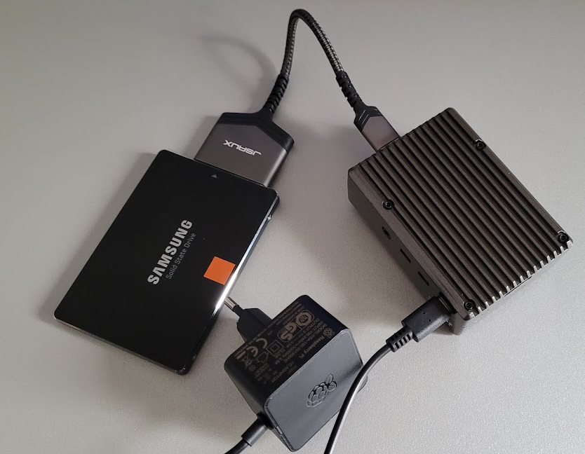

# MyOpenHAB

## Goal

* Latest openHAB release running on a Raspberry Pi 4 as a docker container.
* Automated installation out of this repository.
## Parts list



* Raspberry Pi 4 B, 4x 1,5 GHz, 4 GB RAM, WLAN, BT
* Raspberry 4596 Pi - official power supply for Raspberry Pi 4 Model B, USB-C, 5.1V, 3A
* RPI CASE ALU08 (got it from [here](https://www.reichelt.de/de/de/gehaeuse-fuer-raspberry-pi-4-alu-schwarz-rpi-case-alu08-p272360.html?r=1))
* JSAUX USB 3.0 SATA Adapter (got it from [here](https://www.amazon.de/dp/B086W944YT/ref=cm_sw_r_awdo_navT_g_J4W8QZW49ZTRPVYGJE9D), found it on this [list](https://forum-raspberrypi.de/forum/thread/47876-magische-usb-sata-adapter-und-wo-sie-zu-finden-sind/))
* Some Micro SD card
* Some SATA SSD disk, e.g. 128 GBytes (optional in case of booting from USB)

## Initial Commissioning

* Follow the [official description](https://www.raspberrypi.com/software/) to get Raspberry OS Lite onto the SD card and configure it according to your needs (user account, ssh, WiFi, etc.)
* Boot the Raspberry Pi and login.

## Boot from SSD disk (Optional step)

* For robustness I choose a SSD SATA disk with an USB 3.0 adapter to boot from. Therefore the following steps are necessary:
  * Start raspi-config: 
  ```bash
  sudo raspi-config
  ```
  * Inside raspi-config:
    * 8 Update
    * 6 (Advanced Options) &rarr; A7(Bootloader Version) &rarr; E2(Default)
    * 6 (Advanced Options) &rarr; A6(BootOrder) &rarr; B2(USB Boot)
  * Shutdown:
  ```bash
  sudo shutdown -h now
  ```
  * Remove SD card.
  * Get Raspberry OS Lite onto the SSD (as before with the SD card).
  * Connect SSD and boot.

## Ansible and Docker

My goal was to automate any further installation, configuration and updating. Ansible seems to be the right tool for that job.
* Install Ansible on your control host. I use the Pi itself for this, so I need these packages:
```bash
sudo apt update
sudo apt upgrade
sudo apt install ansible git python3-docker build-essential cargo python3-pip
sudo reboot
```
* As I use the Pi itself as ansible control host the inventory.yml contains the localhost, only. If this setup does not fit to you, adjust the inventory according to your needs.
* Run playbook of this repo to install openHAB:
```bash
git clone --recurse-submodules git@github.com:xxthunder/MyOpenHAB.git
cd MyOpenHAB
ansible-playbook main.yml --extra-vars "piuser=$USER"
```
* After successful installation openHAB incl. frontail services are running:
  * http://<your_pi_hostname>:8080/
  * http://<your_pi_hostname>:9001/

## Sources, References and Ideas

* https://community.openhab.org/t/ansible-revisited/105754
* https://github.com/fex01/ansible-openhabserver
* https://www.laub-home.de/wiki/Raspberry_Pi_mit_Raspbian_und_Docker
